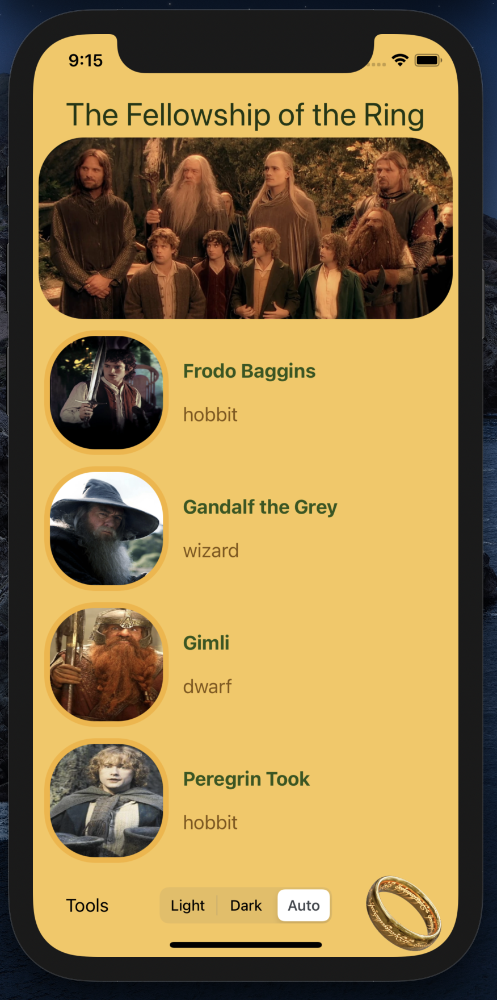
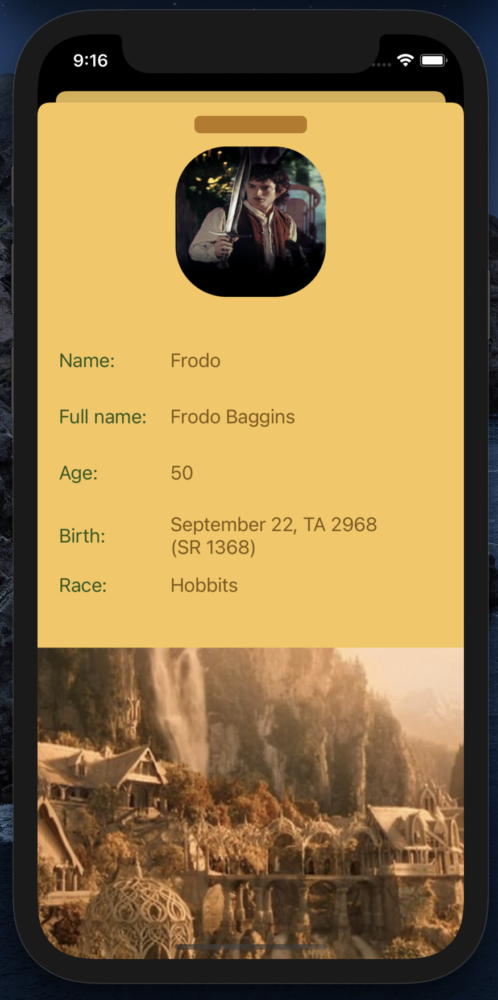
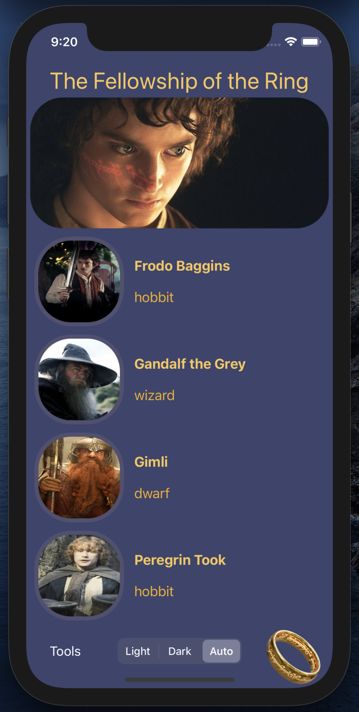
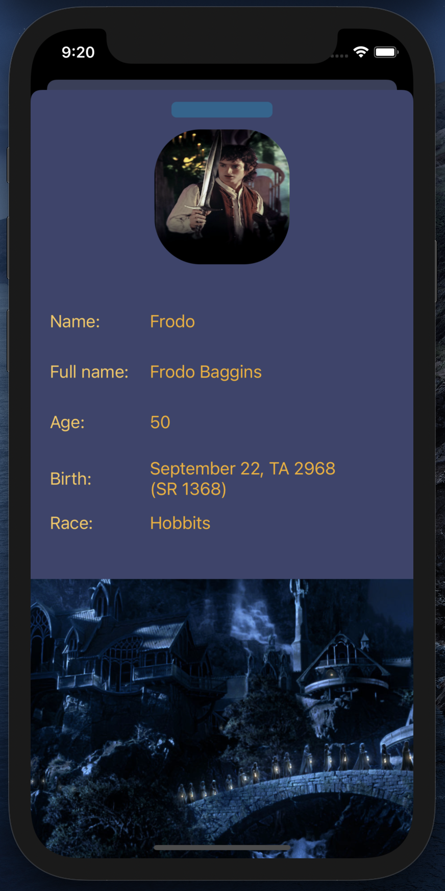

# ios.darkmode.discovery

## Dependencies

# In brief

> This project is used to prove a set of Perseus Dark Mode capabilities.

| Main Screen Light  | Details Screen Light | Main Screen Dark | Details Screen Dark |
| :--------------------: | :----------------------: | :-------------------: | :---------------------: |
|  |  |  |  |

# Requirements

- Xcode 10.1+ (macOS High Sierra - 10.13.6)
- Swift 4.2+
- UIKit SDK

# First-party software

- [Perseus Dark Mode](https://github.com/perseusrealdeal/PerseusDarkMode.git) / [1.1.3](https://github.com/perseusrealdeal/perseusdarkmode/releases/tag/1.1.3)
- [Perseus UI System Kit](https://github.com/perseusrealdeal/PerseusUISystemKit.git) / [1.1.2](https://github.com/perseusrealdeal/perseusuisystemkit/releases/tag/1.1.2)
- [Dark Mode switching functions](https://gist.github.com/perseusrealdeal/11b1bab47f13134832b859f49d9af706)

# Third-party software

- [SwiftLint](https://github.com/realm/SwiftLint) / [0.31.0: Busy Laundromat](https://github.com/realm/SwiftLint/releases/tag/0.31.0) for macOS High Sierra
- [The class](/DiscoveryProject/DarkModeDiscovery/Configuration/ThirdPartyCode/HexColorConverter.swift) extracted, edited and integrated from [UIColor-Hex-Swift](https://github.com/yeahdongcn/UIColor-Hex-Swift)

## License MIT

Copyright © 7530 - 7531 Mikhail Zhigulin of Novosibirsk

Copyright © 7531 PerseusRealDeal

- The year starts from the creation of the world according to a Slavic calendar.
- September, the 1st of Slavic year.

Have a look at [LICENSE](/LICENSE) for details.

TODO: Add some special words about app's theme images and text that were found on the seas of Internet.

## Author and Acknowledgments

This app called as `DarkModeDiscovery` was written at Novosibirsk by Mikhail Zhigulin i.e. me, mzhigulin@gmail.com.

> Mostly I'd like thank my lovely parents for supporting me in all my ways.
