ios.darkmode.discovery
======================
Discovery project for iOS Dark Mode with samples and demo content.


[](https://github.com/perseusrealdeal/DarkMode/releases/tag/1.0.0)
[](http://doge.mit-license.org)

## Table of contents

[Introductory remarks](#introductory)
1. [Releasing Dark Mode](#darkmode)
    + [Settings App for option Release](#darkmodesettingsapp)
    + [Using Dark Mode option in the App](#darkmodeinsidetheapp)
2. [Custom Colors](#customcolors)
3. [Adapted Colors](#adaptedcolors)
    + [System Colors](#systemcolors)
    + [Semantic Colors](#semanticcolors)
4. [Dynamic Image](#dynamicimage)

[Licenses](#licenses)

## Introductory remarks <a name="introductory"></a>

Key points: Dark Mode, Custom Colors, Adapted Colors, and Dynamic Images—brought to life with [Perseus Dark Mode](https://github.com/perseusrealdeal/DarkMode.git).

| Main Screen Light  | Details Screen Light | Main Screen Dark | Details Screen Dark |
| :--------------------: | :----------------------: | :-------------------: | :---------------------: |
|  |  |  |  |

## Releasing Dark Mode <a name="darkmode"></a>

### Settings App for option Release <a name="darkmodesettingsapp"></a>

`The first step:` describe user interface using settings bundle—screenshots and Root.plist are below.

| Settings App Screen: Option | Settings App Screen: Values |
| :-------------------------------: | :-------------------------------: |
| 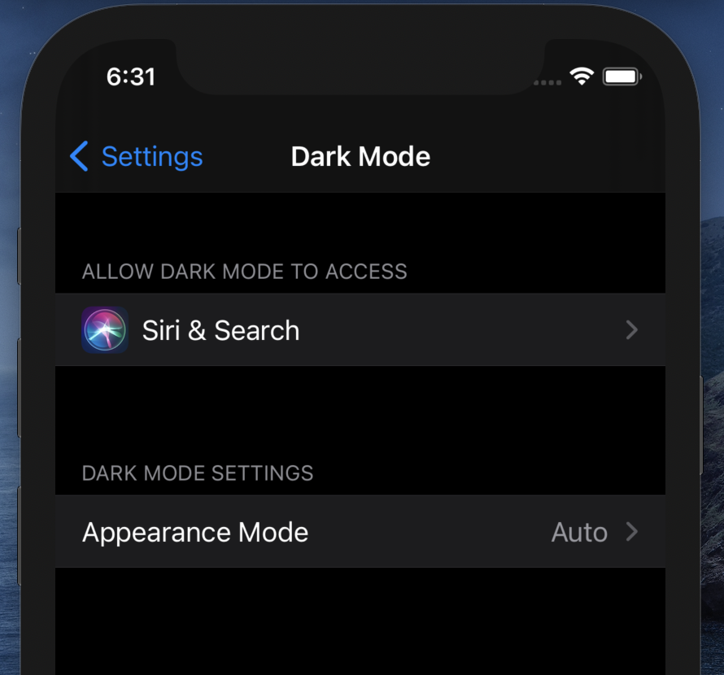 | 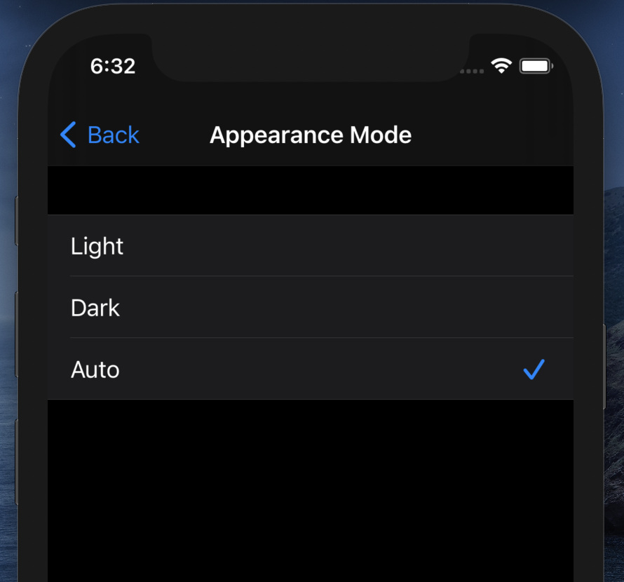 |

```xml
<?xml version="1.0" encoding="UTF-8"?>
<!DOCTYPE plist PUBLIC "-//Apple//DTD PLIST 1.0//EN" "http://www.apple.com/DTDs/PropertyList-1.0.dtd">
<plist version="1.0">
<dict>
    <key>StringsTable</key>
    <string>Root</string>
    <key>PreferenceSpecifiers</key>
    <array>
        <dict>
            <key>Type</key>
            <string>PSMultiValueSpecifier</string>
            <key>Title</key>
            <string>Appearance Mode</string>
            <key>Key</key>
            <string>dark_mode_preference</string>
            <key>DefaultValue</key>
            <integer>0</integer>
            <key>Titles</key>
            <array>
                <string>Light</string>
                <string>Dark</string>
                <string>Auto</string>
            </array>
            <key>Values</key>
            <array>
                <integer>2</integer>
                <integer>1</integer>
                <integer>0</integer>
            </array>
        </dict>
    </array>
</dict>
</plist>
```

`The second step:` make the option's business logic getting work.

One of the most reliable way to make the business logic of Dark Mode option of Setting App getting work is processing `UIApplication.didBecomeActiveNotification` event when `viewWillAppear`/`viewWillDisappear` called.

```swift
override func viewWillAppear(_ animated: Bool)
{
    super.viewWillAppear(animated)
    
    NotificationCenter.default.addObserver(self,
                                           selector: #selector(theAppDidBecomeActive),
                                           name    : UIApplication.didBecomeActiveNotification,
                                           object  : nil)
}

override func viewWillDisappear(_ animated: Bool)
{
    super.viewWillDisappear(animated)
    
    NotificationCenter.default.removeObserver(self,
                                      name  : UIApplication.didBecomeActiveNotification,
                                      object: nil)
}
```

`The third step:` process Dark Mode Settings value on `UIApplication.didBecomeActiveNotification` event.

```swift
@objc func theAppDidBecomeActive()
{
    // Check Dark Mode in Settings
    if let choice = isDarkModeSettingsChanged()
    {
        changeDarkModeManually(choice)
    }
}
```
`The fourth step:` change Appearance Style if Dark Mode option has changed.

```swift
import UIKit
import PerseusDarkMode

public let DARK_MODE_SETTINGS_KEY = "dark_mode_preference"

func changeDarkModeManually(_ userChoice: DarkModeOption)
{
    // Change Dark Mode value in settings bundle
    UserDefaults.standard.setValue(userChoice.rawValue, forKey: DARK_MODE_SETTINGS_KEY)
    
    // Change Dark Mode value in Perseus Dark Mode library
    AppearanceService.DarkModeUserChoice = userChoice
    
    // Update appearance in accoring with changed Dark Mode Style
    AppearanceService.makeUp()
}
```
```swift
func isDarkModeSettingsChanged() -> DarkModeOption?
{
    // Load enum int value from settings
    
    let option = UserDefaults.standard.valueExists(forKey: DARK_MODE_SETTINGS_KEY) ?
        UserDefaults.standard.integer(forKey: DARK_MODE_SETTINGS_KEY) : -1
    
    // Try to cast int value to enum
    
    guard option != -1, let settingsDarkMode = DarkModeOption.init(rawValue: option)
    else { return nil }
    
    // Report change
    
    return settingsDarkMode != AppearanceService.DarkModeUserChoice ? settingsDarkMode : nil
}
```

### Using Dark Mode option in the App <a name="darkmodeinsidetheapp"></a>

`The first step:` make a user control and place it on a screen.

| Dark Mode User Control Light | Dark Mode User Control Dark | 
| :---------------------------------: | :---------------------------------: |
| 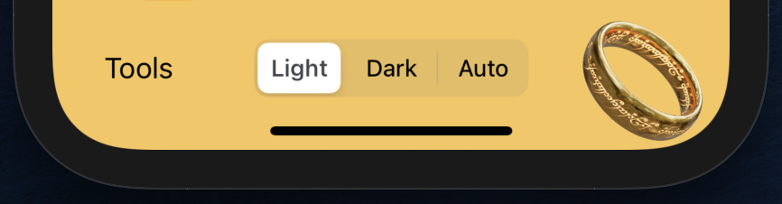 | 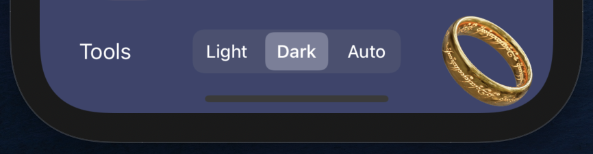 |

`The second step:` give it a processing logic on change event.

```swift

// Configure Dark Mode user control

optionsPanel.segmentedControlValueChangedClosure = { option in changeDarkModeManually(option) }
optionsPanel.segmentedControlValue = AppearanceService.DarkModeUserChoice
```

## Custom Colors <a name="customcolors"></a>

The question is, how to have a color that is sensetive to Dark Mode.

For instance, lets try to realese TEAL color using [the apple specification](https://developer.apple.com/design/human-interface-guidelines/ios/visual-design/color/).

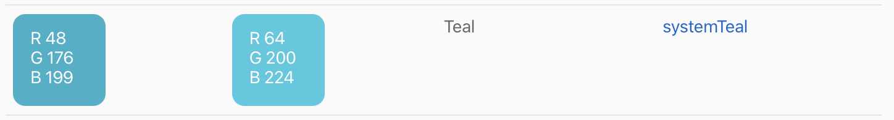

`The first step:` define a requirement.

```swift
import UIKit

protocol UICustomColors
{
    static var _customTeal                : UIColor { get }
}
```

`The second step:` give it a conditional value using `AppearanceService.shared.Style` as a criteria.

```swift
import UIKit
import PerseusDarkMode

extension UIColor: UICustomColors
{
    static var _customTeal                : UIColor
    {
        AppearanceService.shared.Style == .light ? #colorLiteral(red: 0.1882352941, green: 0.6901960784, blue: 0.7803921568, alpha: 1) : #colorLiteral(red: 0.2509803921, green: 0.7843137254, blue: 0.8784313725, alpha: 1)
    }
}
```

`The third step:` almost is about how it's done.

At this step the smart choice should be done, either use `AppearanceService.makeUp()` or create observer for getting change of `AppearanceService.shared.StyleObservable`.

Look at README of [Perseus Dark Mode](https://github.com/perseusrealdeal/DarkMode.git) for details.

## Adapted Colors <a name="adaptedcolors"></a>

### System Colors <a name="systemcolors"></a>

[Perseus Dark Mode](https://github.com/perseusrealdeal/DarkMode.git) ensures that the system colors listed in [the apple specification](https://developer.apple.com/design/human-interface-guidelines/ios/visual-design/color/) gives the same look also and on early apple devices starting from iOS 9.

| System Colors Light | System Colors Dark | 
| :----------------------: | :---------------------: |
| 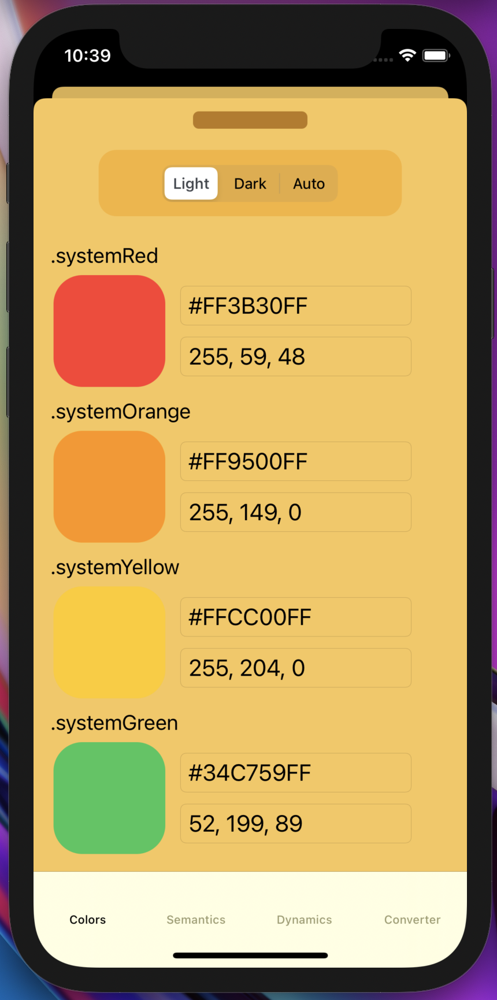 | 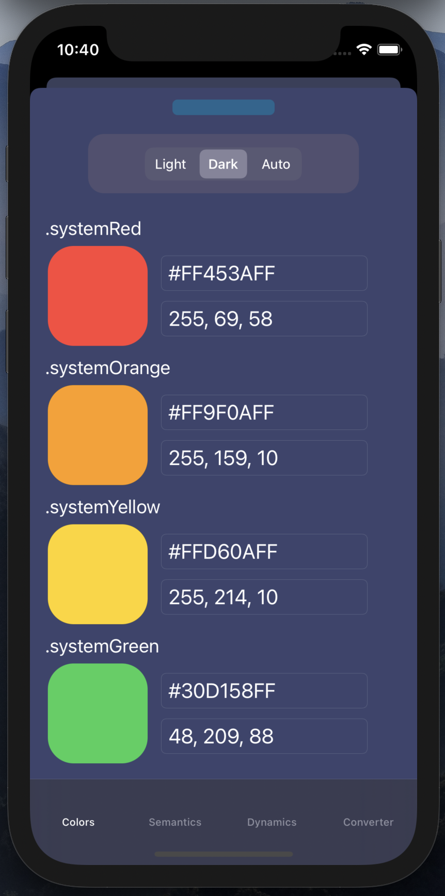 |

```swift
import AdaptedSystemUI

let view = UIView()
view.backgroundColor = .systemRed_Adapted
```

### Semantic Colors <a name="semanticcolors"></a>

For semantic colors also listed in [the apple specification](https://developer.apple.com/design/human-interface-guidelines/ios/visual-design/color/) Apple Inc. doesn't give RGBA specifics—Apple Inc. reserves the right to tweak a litle bit any semantic color later.

[Perseus Dark Mode](https://github.com/perseusrealdeal/DarkMode.git) takes RGBA from the semantic colors as it was released at the first time and brings it to early apple devices as adapted colors.

| Semantic Colors Light | Semantic Colors Dark | 
| :------------------------: | :------------------------: |
| 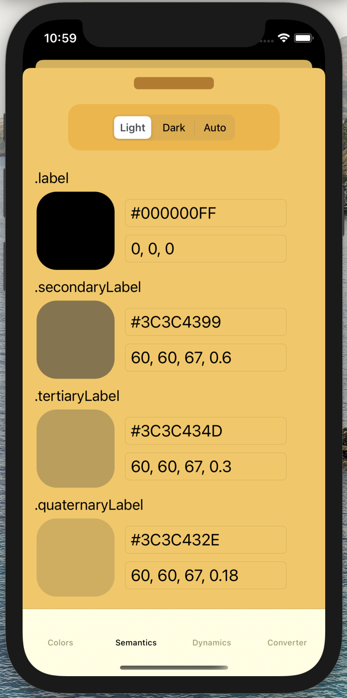 | 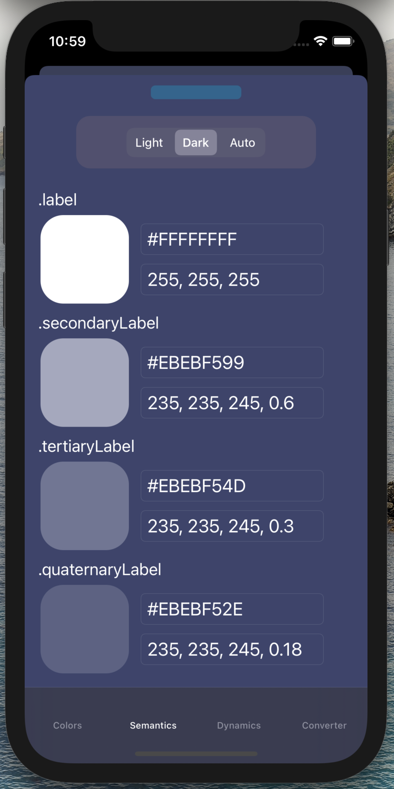 |

```swift
import AdaptedSystemUI

let view = UIView()
view.backgroundColor = .label_Adapted
```

## Dynamic Image <a name="dynamicimage"></a>

| Dynamic Image View Light | Dynamic Image View Dark | 
| :-----------------------------: | :-----------------------------: |
| 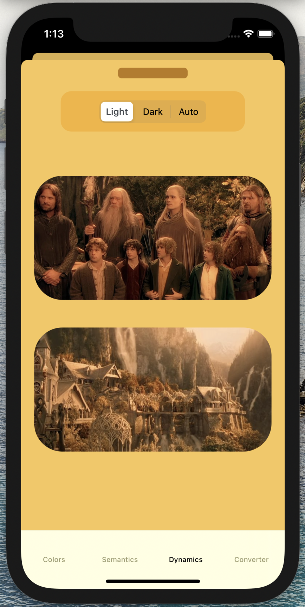 | 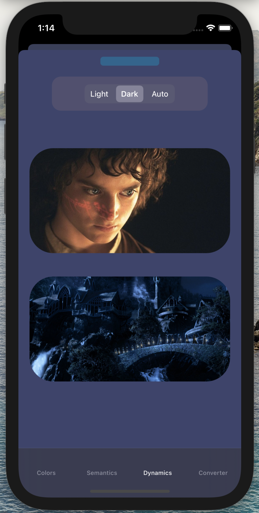 |

```swift
import UIKit
import PerseusDarkMode

var topImage = DarkModeImageView()
var bottomImage = DarkModeImageView()

topImage.setUp(UIImage(named: "TheFellowship"), UIImage(named: "FrodoWithTheRing"))
bottomImage.setUp(UIImage(named: "Rivendell"), UIImage(named: "RivendellDark"))
```

## Licenses <a name="licenses"></a>

`License for this app`

```
Copyright © 7530 Mikhail Zhigulin of Novosibirsk, where 7530 is
the year from the creation of the world according to a Slavic calendar.

Permission is hereby granted, free of charge, to any person obtaining a copy
of this software and associated documentation files (the "Software"), to deal
in the Software without restriction, including without limitation the rights
to use, copy, modify, merge, publish, distribute, sublicense, and/or sell
copies of the Software, and to permit persons to whom the Software is
furnished to do so, subject to the following conditions:

The above copyright notice and this permission notice shall be included in all
copies or substantial portions of the Software.

THE SOFTWARE IS PROVIDED "AS IS", WITHOUT WARRANTY OF ANY KIND, EXPRESS OR
IMPLIED, INCLUDING BUT NOT LIMITED TO THE WARRANTIES OF MERCHANTABILITY,
FITNESS FOR A PARTICULAR PURPOSE AND NONINFRINGEMENT. IN NO EVENT SHALL THE
AUTHORS OR COPYRIGHT HOLDERS BE LIABLE FOR ANY CLAIM, DAMAGES OR OTHER
LIABILITY, WHETHER IN AN ACTION OF CONTRACT, TORT OR OTHERWISE, ARISING FROM,
OUT OF OR IN CONNECTION WITH THE SOFTWARE OR THE USE OR OTHER DEALINGS IN THE
SOFTWARE.
```

`License for the usage of HexColorConverter.swift as the third party code`

LINK: [UIColor-Hex-Swift repository](https://github.com/SeRG1k17/UIColor-Hex-Swift.git).

The top lines from the origin code used as the third party code:

```
//  StringExtension.swift
//  HEXColor-iOS
//
//  Created by Sergey Pugach on 2/2/18.
//  Copyright © 2018 P.D.Q. All rights reserved.
```
License from the root of [UIColor-Hex-Swift repository](https://github.com/SeRG1k17/UIColor-Hex-Swift/blob/3a65da534b71b3e6909f6ada6bfdd3b80ee43ca8/LICENSE):

```
Copyright (c) 2014 R0CKSTAR

Permission is hereby granted, free of charge, to any person obtaining a copy
of this software and associated documentation files (the "Software"), to deal
in the Software without restriction, including without limitation the rights
to use, copy, modify, merge, publish, distribute, sublicense, and/or sell
copies of the Software, and to permit persons to whom the Software is
furnished to do so, subject to the following conditions:

The above copyright notice and this permission notice shall be included in all
copies or substantial portions of the Software.

THE SOFTWARE IS PROVIDED "AS IS", WITHOUT WARRANTY OF ANY KIND, EXPRESS OR
IMPLIED, INCLUDING BUT NOT LIMITED TO THE WARRANTIES OF MERCHANTABILITY,
FITNESS FOR A PARTICULAR PURPOSE AND NONINFRINGEMENT. IN NO EVENT SHALL THE
AUTHORS OR COPYRIGHT HOLDERS BE LIABLE FOR ANY CLAIM, DAMAGES OR OTHER
LIABILITY, WHETHER IN AN ACTION OF CONTRACT, TORT OR OTHERWISE, ARISING FROM,
OUT OF OR IN CONNECTION WITH THE SOFTWARE OR THE USE OR OTHER DEALINGS IN THE
SOFTWARE.
```
